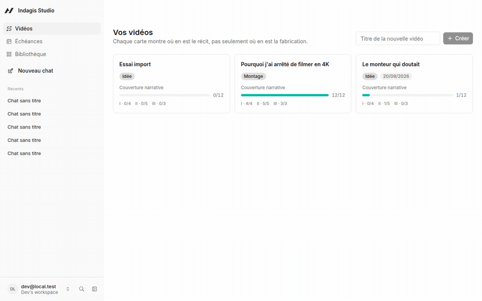
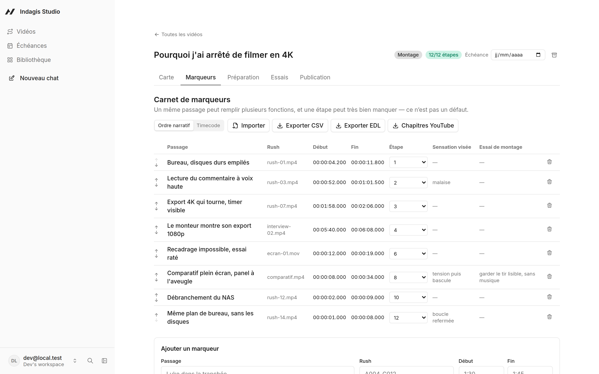
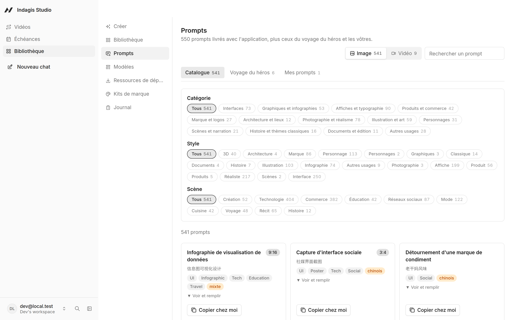
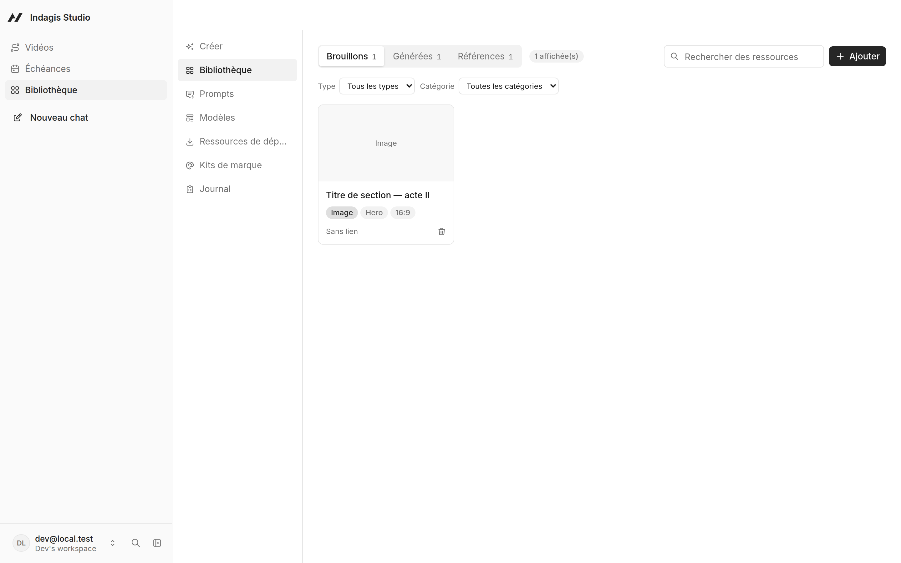
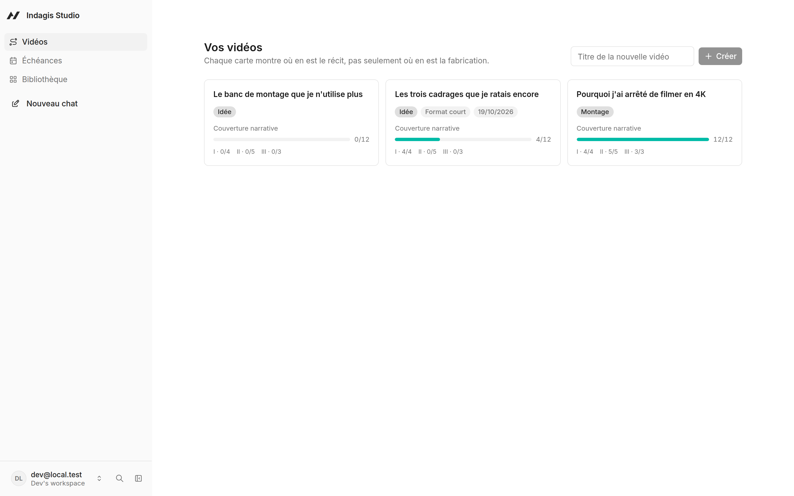
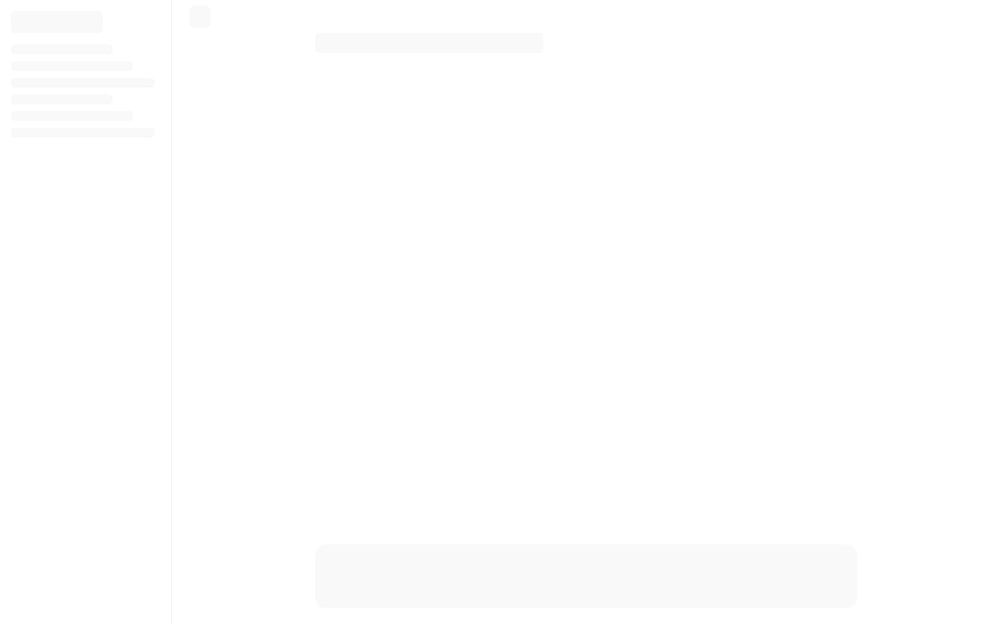

# Indagis Studio

[](https://github.com/agtktID/indagisdisign/actions/workflows/ci.yml)
[](LICENSE)

Un atelier de **structuration narrative pour le montage vidéo**, fondé sur la méthode du
voyage du héros. Vous posez vos rushes, l'application vous aide à en faire un récit.

Ce n'est pas un logiciel de montage, et ce n'est pas un Trello de plus. C'est l'outil qui
manque entre les deux : celui qui vous dit **ce qui manque à votre histoire**.



*De la liste des vidéos à un brief de composition pour l'acte III, en onze secondes.
Aucun autre outil ne peut exécuter cette phrase : il faut posséder à la fois les étapes
du récit et les timecodes réels des rushes.*

## Ce que ça fait

- **Une carte narrative** — les 12 étapes du voyage du héros, en 3 actes, avec la courbe
  émotionnelle de votre montage. Chaque étape porte la définition, le conseil de montage
  et l'exercice de la méthode.
- **Un carnet de marqueurs** — vos passages repérés, avec leurs timecodes réels, que vous
  pouvez réordonner selon la logique du récit et non celle de la chronologie. Exportable
  en CSV, en **EDL d'assemblage** à importer dans Resolve ou Premiere, et en chapitres
  YouTube.
- **Un import qui vous évite de retaper** — collez un bloc depuis votre dérushage, ou
  donnez le CSV ou l'EDL que vous avez déjà. Une lecture à blanc montre ce qui serait
  créé et ce qui serait refusé, ligne par ligne, avant d'écrire quoi que ce soit.
- **Une fiche de préparation** — les cinq questions à se poser avant de monter.
- **Un diagnostic de structure** — douze règles appliquées mécaniquement à votre carte :
  acte sous-couvert, climax sans enjeu lisible, fin déconnectée, courbe plate… Il se
  lance **depuis la carte**, et chaque remarque déplie l'étape qu'elle concerne.
- **Une boucle d'essais** — observation → hypothèse → tentative → verdict, avec le rappel
  de la règle qui compte : une seule chose à la fois.
- **Un brief de composition** — un bouton par acte, en haut de la carte, qui transforme
  vos notes, vos intensités et vos timecodes en consigne pour l'agent. C'est ce qui rend
  possible « fais-moi un teaser de l'acte III depuis ma carte ».
- **Un agent** qui travaille sur les mêmes données que vous, par le panneau de la barre
  latérale.

> **Un défaut connu, et dit franchement.** La page de chat **plein écran**
> (`/chat/:id`, le bouton « Nouveau chat ») lève
> « AgentKit hooks require an AgentKitProvider. » et n'affiche rien. Le panneau agent de
> la barre latérale fonctionne, et c'est le chemin à prendre en attendant. La cause est
> identifiée jusqu'au commit du framework qui l'a introduite — le détail et les cinq
> correctifs réfutés sont dans
> [`docs/ETAT-DU-PROJET.md`](docs/ETAT-DU-PROJET.md#2-la-page-de-chat-plein-écran-est-cassée).

Tout est en local. Aucun compte à créer, aucune donnée qui part ailleurs.

L'interface est **en français**, et suit la langue du navigateur parmi les onze que le
framework propose. Le contenu de la méthode — les 12 étapes, les 3 actes, les 5 questions
— reste français en toutes langues : c'est du référentiel transcrit de sa source, pas de
la donnée traduisible. Même règle que pour les corps de prompts du catalogue.

## Démarrer

Il faut **Node.js 22.22 ou plus** et **pnpm**.

```bash
git clone <votre-fork>
cd indagis-studio
corepack enable
pnpm install
pnpm dev
```

L'application s'ouvre sur `http://localhost:8080`. Choisissez **« Continuer comme
développeur local »** — aucun mot de passe n'est nécessaire.

Pour que l'agent fonctionne, connectez un modèle depuis l'interface : Builder.io offre des
crédits gratuits, ou utilisez votre propre clé Anthropic, OpenAI, ou un modèle Ollama en
local.

## Fabriquer des vidéos depuis vos cartes

L'agent peut transformer une carte narrative en vidéo. Deux moteurs sont branchés, sous
forme de **ponts locaux** qui démarrent avec l'application — vous n'avez rien à lancer.

| Moteur | Licence | Outils |
| --- | --- | --- |
| [HyperFrames](https://github.com/heygen-com/hyperframes) | Apache-2.0 | 7 |
| [Remotion](https://www.remotion.dev) | source-available, **voir ci-dessous** | 8 |

Le rendu se fait **sur votre machine**. Il faut donc **Chrome** et **ffmpeg** installés.
Pour vérifier :

```bash
node tools/hyperframes-bridge/smoke-test.mjs
node tools/remotion-bridge/smoke-test.mjs
```

### Remotion n'est pas open source

Remotion est gratuit pour les particuliers, les organisations à but non lucratif et les
entreprises **de trois salariés au plus**. Au-delà, une licence d'entreprise est requise —
voir [remotion.pro/license](https://www.remotion.pro/license).

Indagis Studio **ne distribue pas** Remotion : le pont l'installe à la demande dans votre
propre projet vidéo. Vous restez responsable de votre éligibilité.

HyperFrames, en Apache-2.0, n'a aucune de ces contraintes.

### Désactiver les ponts

Les ponts exécutent des commandes sur votre machine. Ils sont volontairement étroits —
liste blanche de sous-commandes, jamais de shell, écritures confinées au dossier `video/`.
Si vous n'en voulez pas, supprimez `mcp.config.json` : l'application fonctionne sans.

## À quoi ça ressemble

| | |
| --- | --- |
| **Le carnet de marqueurs** — chaque moment repéré dans les rushes, avec son timecode, rattaché à une étape du récit. Triable en ordre narratif, qui n'est pas l'ordre chronologique. |  |
| **Le catalogue de prompts** — 550 prompts livrés, triables par catégorie, style et scène. |  |
| **La bibliothèque de ressources** — vos visuels rangés par type, catégorie et format. |  |
| **Vos vidéos** — chaque carte montre où en est le récit, pas seulement où en est la fabrication. |  |



Les images se régénèrent toutes seules, et c'est volontaire — une capture qui ment sur
l'état du produit est pire que pas de capture. **Le contenu qu'elles montrent est du
code**, pas une base locale : `seed-demo.mjs` pose un récit de démonstration complet, et
n'importe qui peut refaire les mêmes images à l'identique. Lancer `pnpm dev` dans un
autre terminal, puis, sur une base vierge :

```bash
node tools/captures/seed-demo.mjs <chromium> http://localhost:8080
node tools/captures/shoot.mjs <chromium> http://localhost:8080 docs/captures <id-video>
node tools/captures/demo.mjs <chromium> <ffmpeg> http://localhost:8080 docs/captures/demo.gif <id-video>
```

`seed-demo.mjs` imprime l'identifiant à passer aux deux autres. Il **refuse de tourner
sur une base qui contient déjà des vidéos** : écraser un vrai travail pour fabriquer une
capture serait un mauvais échange, et `--force` rend ce geste délibéré.

L'identifiant doit désigner une vidéo à la carte complète, sinon les images montrent un
écran vide. `shoot.mjs` visite des URL ; `demo.mjs` **joue le parcours** — c'est la seule
façon de montrer qu'un bouton agit. Les deux binaires sont ceux que Playwright installe
(`~/.cache/ms-playwright/`), aucune dépendance ajoutée au projet.

Le jeu de démonstration écrit **par les actions, en HTTP**, comme l'interface : il passe
donc par les mêmes règles métier que n'importe quelle saisie, et une capture ne peut pas
montrer un état que l'application refuserait.

## Comment c'est construit

Sur [Agent-Native](https://www.agent-native.com) (MIT), en application autonome.

```
actions/              42 actions métier — chacune est à la fois outil d'agent,
                      hook React, route HTTP et commande en ligne
server/db/            13 tables PostgreSQL (PGlite en local)
shared/               la méthode : 12 étapes, 3 actes, 5 questions, 5 symptômes
shared/prompt-catalog/ 550 prompts, généré — voir tools/prompt-catalog/
app/routes/           4 écrans — les vidéos, la fiche, le calendrier, la bibliothèque
.agents/              ce que l'agent sait faire
tools/                les ponts vidéo et l'import du catalogue
specs/                la spécification, le plan et les tâches (Spec Kit)
```

Le contenu de la méthode vit dans `shared/hero-journey.ts`, pas en base : c'est du
référentiel, pas de la donnée utilisateur. Même principe pour le catalogue de
prompts et les ressources de départ — livrés dans le code, donc présents dès
l'installation, et intouchables autrement qu'en les copiant.

## Le catalogue de prompts

La bibliothèque embarque **550 prompts** — 541 pour l'image, 9 cas d'usage vidéo —
triables sur trois axes : catégorie, style, scène. Les corps sont repris tels quels
de deux dépôts sous licence MIT ; seuls les titres ont été traduits en français, le
titre d'origine restant affiché sous chaque fiche.

Voir [`CREDITS.md`](CREDITS.md) pour l'attribution, et
[`tools/prompt-catalog/README.md`](tools/prompt-catalog/README.md) pour reconstruire
le catalogue depuis une autre source.

## Vérifier

```bash
bash scripts/verifier.sh
```

Vingt-quatre critères, chacun avec la commande qui le démontre : les quatre portes, les
frontières d'architecture, le parcours complet d'un monteur contre une vraie base, et la
bibliothèque. Le script finit par ce qui reste **non prouvé** — il ne prétend pas que
tout est vérifié quand ça ne l'est pas.

L'un de ces critères vérifie qu'**aucune action métier n'est dépourvue de bouton**. Il a
été ajouté après coup : `get-narrative-brief` a vécu une PR entière sans point d'entrée,
marchait en ligne de commande, et échouait en 405 dans un navigateur. Rien ne le voyait,
puisqu'il n'y avait rien à cliquer.

Les portes seules, si c'est tout ce que vous voulez :

```bash
pnpm typecheck
pnpm test
pnpm agent-native:doctor
pnpm build
```

## Où en est le projet

[`docs/ETAT-DU-PROJET.md`](docs/ETAT-DU-PROJET.md) dit ce qui est fait et ce qui reste,
avec la commande qui reprouve chaque ligne. C'est le document à lire avant de proposer
quoi que ce soit.

## Contribuer

Les règles du projet et les trois portes à passer sont dans
[CONTRIBUTING.md](CONTRIBUTING.md). Pour une faille de sécurité, ne pas ouvrir
d'issue : voir [SECURITY.md](SECURITY.md).

## Licence

[MIT](LICENSE).

Le projet embarque du contenu de tiers, conservé avec son attribution — 550 prompts
sous licence MIT, et la méthode narrative transcrite de sa source. Le détail est
dans [CREDITS.md](CREDITS.md).

Un mot sur les moteurs vidéo : **HyperFrames** est en Apache-2.0 et proposé par
défaut. **Remotion n'est pas open source** — gratuit pour les particuliers, les
associations et les entreprises de trois salariés au plus, licence d'entreprise
au-delà. Ce n'est donc pas une dépendance d'Indagis Studio : le pont l'installe à la
demande dans votre projet vidéo, et c'est à ce moment que vous acceptez sa licence.
